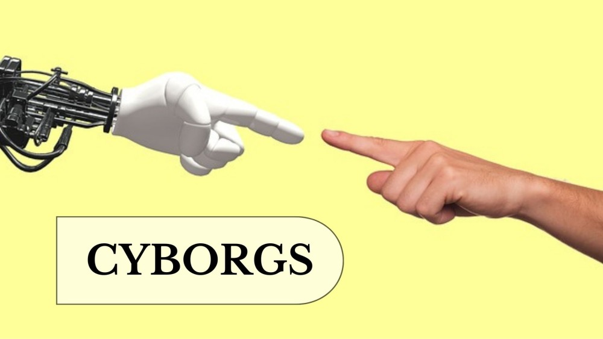

As I mentioned in the introduction, nowadays technology is more and more present in the lives of human beings and that with it, a much stronger connection between technology and people has been created, but the definition of cyborg is deeper than this, and goes further...

**_What is a cyborg?_**

For this definition we can find multiple opinions, as there are those who define them as beings formed by living matter and electronic devices, and those who distinguish between these and the so-called human cyborgs, which are defined as people who, thanks to having cybernetic devices incorporated into their bodies, are able to develop capacities and abilities that they would not be able to have without these devices. I am going to focus mainly on the latter, and more specifically on those who are officially classified as such. 
