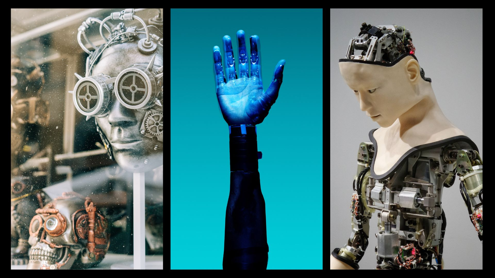

## ARTIFICIAL INTELLIGENCE

Photos by Gabriella Clare Marino, ThisisEngineering RAEng and Possessed Photography on Unsplash.

**_What is it?_**

Artificial intelligence can be defined as anything that a machine or system does in order to mimic or resemble as closely as possible any human behaviour.

**_Why is Artificial Intelligence important?_**
- AI is able to automate learning and different types of computational tasks with a high degree of difficulty and volume in a reliable and effortless way.
- It analyses large amounts of data through neural networks. The more data it obtains, the more accurate and deeper its analysis will be. 
- Artificial Intelligence is responsible for improving some of the products already on the market with its resources, such as, for example, the case of Siri in Apple products.
- The incredible precision that AI provides creates a great opportunity to develop fields such as medicine, where artificial intelligence techniques of deep learning, image classification and object recognition can now be used to detect diseases such as cancer.
- AI enables the programming of data through progressive learning algorithms.

**DIGITAL IDENTITIES**

**_What is it?_**

Digital identity is the set of personal data that people publish and upload to the Internet, including photos, comments, personal data, friendships, tastes, hobbies, etc.
As time goes by, the Internet is growing and with it multiple technological advances are emerging, which means that our digital identity is more exposed and we must learn to develop it correctly in order to guarantee security and privacy.

The first topic I´m going to talk is: [Transhumanism](transhumanism.md) 

Finally, another topic I would like to comment on is the chatbot that Microsoft has patented.

**MICROSOFT CHATBOT**

This consists of a chat that would allow people to communicate with those who have died. The basis of this project is the digital identity that these deceased people have on the web, as the idea is to use all the data that exists on the internet about them. From photos, videos, voice recordings, and publications on social networks to emails, among many other things. All this data would be stored and used by different artificial intelligence tools to create a kind of avatar with which to interact through this chat. 

In addition, you could not only communicate with friends or family but also with famous, historical, or fictional characters. Even photos and videos would be able to recreate that person in 2D and 3D. 

Such an idea is perfectly shown in one of the most famous episodes of the Black Mirror series called "Be Right back" in which a young woman, after losing her husband, decides to use all the data of her digital identity to digitally revive him and be able to talk to him as if he were still alive. 

Today this Microsoft project has been stopped and has no thoughts of being developed in the market, as it would have too many ethical repercussions and because it is a somewhat disturbing idea when dealing with deceased people. But at the same time, this serves to make us realise how far technology and companies can and would be willing to go.  

This makes me wonder how much personal stuff we put on the web and how important artificial intelligence and the systems it uses are today. With today's technology and as this chat proposes, they are capable of completely imitating people's personalities thanks to all the information and data that we provide, sometimes without even realising it. So, it is very important to be careful with the things we upload to the internet and what we talk about, as this will be stored and identified with the person we are.

