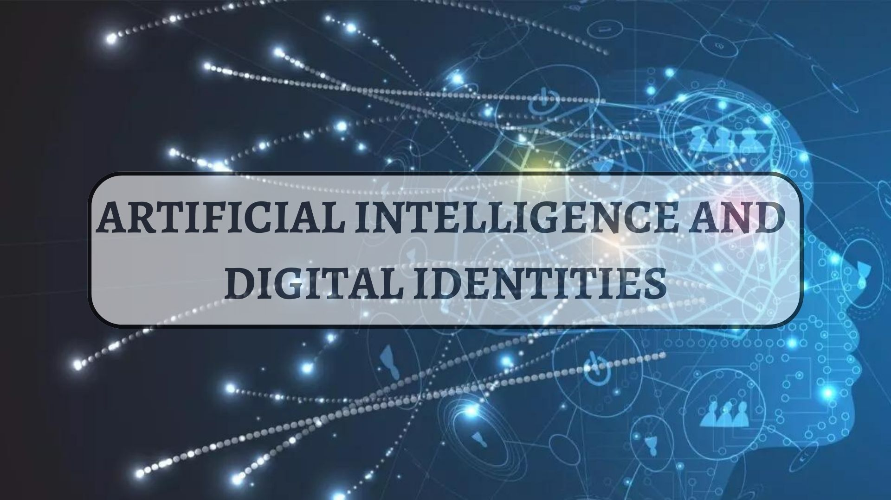

## INTRODUCTION
**ARTIFICIAL INTELLIGENCE**

**_What is it?_**

Artificial intelligence can be defined as anything that a machine or system does in order to mimic or resemble as closely as possible any human behaviour.

**_Why is Artificial Intelligence important?_**
- AI is able to automate learning and different types of computational tasks with a high degree of difficulty and volume in a reliable and effortless way.
- It analyses large amounts of data through neural networks. The more data it obtains, the more accurate and deeper its analysis will be. 
- Artificial Intelligence is responsible for improving some of the products already on the market with its resources, such as, for example, the case of Siri in Apple products.
- The incredible precision that AI provides creates a great opportunity to develop fields such as medicine, where artificial intelligence techniques of deep learning, image classification and object recognition can now be used to detect diseases such as cancer.
- AI enables the programming of data through progressive learning algorithms.

**DIGITAL IDENTITIES**

**_What is it?_**

Digital identity is the set of personal data that people publish and upload to the Internet, including photos, comments, personal data, friendships, tastes, hobbies, etc.
As time goes by, the Internet is growing and with it multiple technological advances are emerging, which means that our digital identity is more exposed and we must learn to develop it correctly in order to guarantee security and privacy.

