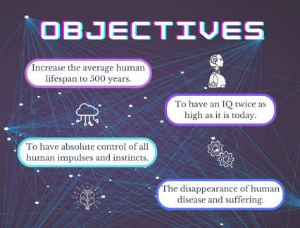

As I mentioned in the introduction, nowadays technology is more and more present in the lives of human beings and that with it, a much stronger connection between technology and people has been created. Because of this a very interesting and disturbing new theory has arisen which I am going to talk about below. 

### TRANSHUMANISM
**_What is it?_**

Transhumanism is: "a cultural, intellectual and scientific movement that affirms the moral duty to enhance the physical and cognitive capacities of the human species, and to apply new technologies to man, so that unwanted and unnecessary aspects of the human condition, such as suffering, disease, ageing and even mortality, can be eliminated" (Nick Bostrom, World Tranhumanist Association).

  

