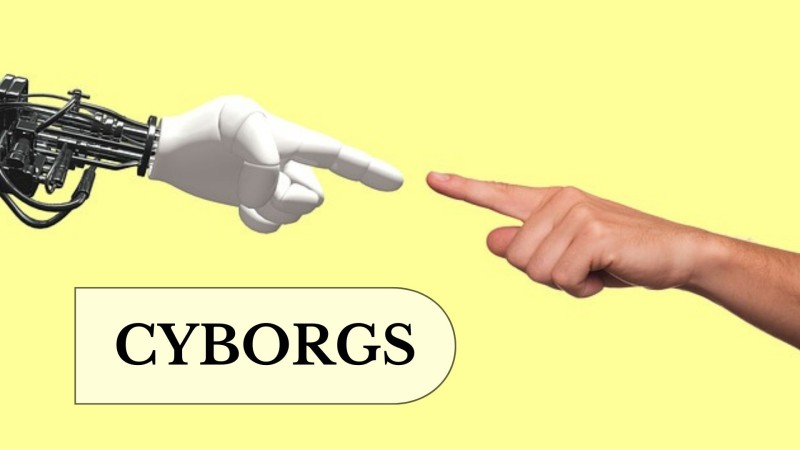

  

As I mentioned in the introduction, nowadays technology is more and more present in the lives of human beings and that with it, a much stronger connection between technology and people has been created. Because of this a very interesting and disturbing new theory has arisen which I am going to talk about below. 

 ### TRANSHUMANISM
